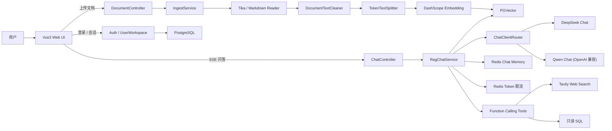
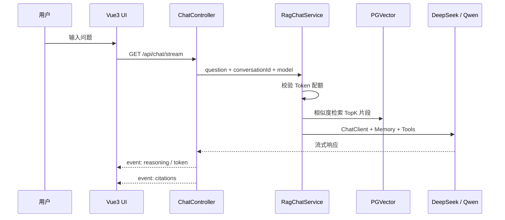

# Spring AI 共享知识库问答助手

基于 Spring AI 2.0 的共享知识库 RAG 问答系统。团队成员共同上传文档扩展同一套知识库，个人会话与邮箱身份绑定，支持文档入库、语义检索、SSE 流式问答、引用溯源、多轮记忆、Token 限流、Function Calling 与多模型路由。

## 技术栈

| 层级 | 技术 |
|---|---|
| 后端 | Spring Boot 4.1 / Java 25 / Spring AI 2.0.0 |
| Chat 模型 | DeepSeek `deepseek-v4-pro` / 通义千问 `qwen3.7-plus`（OpenAI 兼容端点） |
| Embedding | DashScope `text-embedding-v4`（2048 维） |
| 向量库 | PostgreSQL + PGVector（HNSW / 余弦距离） |
| Schema 管理 | Flyway |
| 记忆与限流 | Redis Stack / Spring AI Chat Memory Repository |
| 工具调用 | Spring AI `@Tool` / Tavily Search / JDBC 只读 SQL |
| 前端 | Vue3 / Vite / TypeScript |

## 模块结构

```text
ai-kb-assistant/
├── kb-assistant-server/     # Spring Boot 后端：文档入库、RAG、SSE、工具调用
├── kb-assistant-web-ui/     # Vue3 前端：文档上传、流式对话、引用展示
├── docker/                  # PGVector + Redis Stack
├── docs/                    # 设计文档与实现计划
└── pom.xml                  # Maven 聚合父工程
```

## 架构图



## 问答时序



## 截图


## 环境要求

- Java 25
- Maven 3.9+（或 mvnd）
- Node.js 20+ / npm 10+
- Docker Desktop
- DeepSeek API Key、DashScope（OpenAI 兼容）API Key、Tavily API Key（联网搜索可选）

## 环境变量

复制 `.env.example` 为 `.env` 并填入真实 Key：

```bash
OPENAI_API_KEY=sk-xxx      # DashScope 兼容端点 Key，用于 Embedding 与 Qwen Chat
DEEPSEEK_API_KEY=sk-xxx    # 默认 Chat 模型
TAVILY_API_KEY=tvly-xxx    # 联网搜索工具
DB_USER=postgres
DB_PASSWORD=postgres
```

## 启动方式

### 1. 启动基础设施

```powershell
docker compose -f docker/docker-compose.yml up -d
```

| 服务 | 镜像 | 端口 |
|---|---|---|
| PostgreSQL + PGVector | `pgvector/pgvector:pg17` | `5432` |
| Redis Stack | `redis/redis-stack:latest` | `6379` / `8001` |

注意：Spring AI Redis Chat Memory 依赖 RediSearch，必须使用 Redis Stack。

### 2. 启动后端

```powershell
$env:OPENAI_API_KEY="你的 DashScope Key"
$env:DEEPSEEK_API_KEY="你的 DeepSeek Key"
$env:TAVILY_API_KEY="你的 Tavily Key"

mvn -pl kb-assistant-server spring-boot:run
```

后端监听 `http://localhost:8080`，数据库 schema 由 Flyway 启动时自动迁移。

### 3. 启动前端

```powershell
Set-Location kb-assistant-web-ui
npm install
npm run dev
```

前端监听 `http://localhost:5173`，Vite 已将 `/api` 代理到 `http://localhost:8080`。

## 主要接口

| 方法 | 路径 | 说明 |
|---|---|---|
| `POST` | `/api/documents` | 上传文档，表单字段 `file` |
| `GET` | `/api/documents/details` | 共享知识库文档详情 |
| `GET` | `/api/chat/stream` | SSE 流式问答（`reasoning` / `token` / `citations` 事件） |
| `POST` | `/api/chat` | 非流式问答 |
| `POST` | `/api/auth/email/login` | 邮箱登录 |
| `GET` | `/api/users/{email}/sessions` | 个人会话列表 |

## 注意事项

- Embedding 维度为 2048，需与 `vector_store` 表 `VECTOR(2048)` 一致；更换嵌入模型需重建表与已入库向量。
- SQL 工具仅允许 `SELECT` 且最多返回 100 行。
