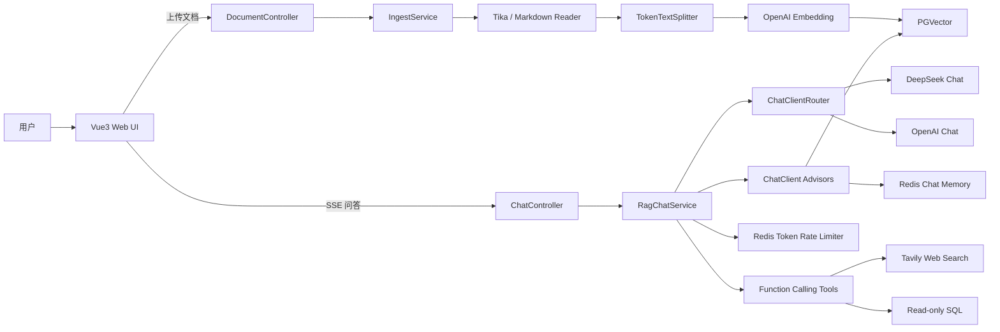
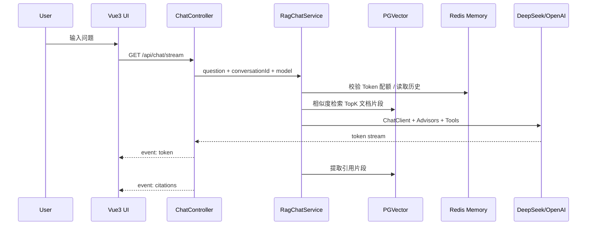
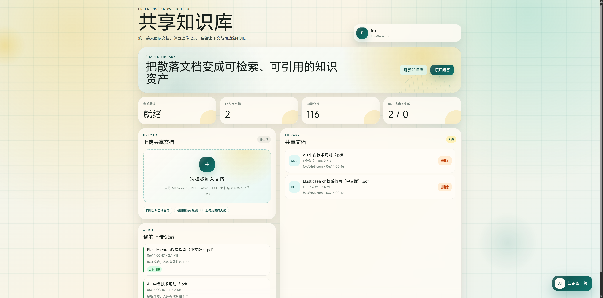
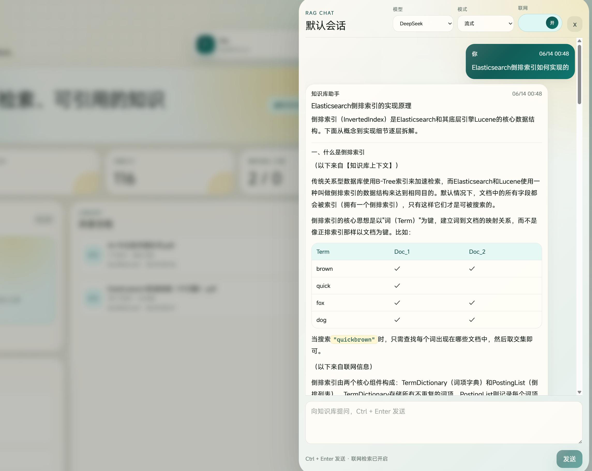
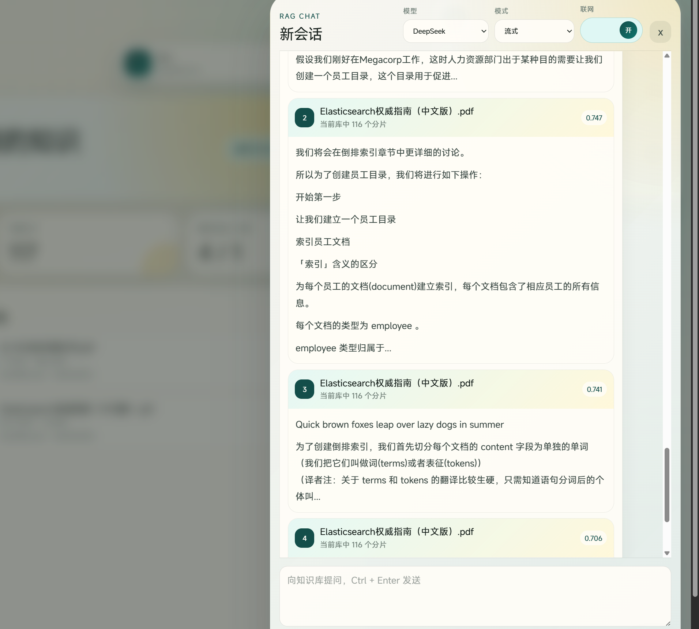

# Spring AI 个人知识库问答助手

基于 Spring AI 2.0 的个人知识库问答系统，支持本地文档入库、语义检索、SSE 流式问答、引用溯源、多轮会话记忆、Token 限流、Function Calling 工具调用和多模型路由。

这个项目定位为 Java AI 应用开发练手项目，也可以作为 RAG / Agent 工程模板。

## 项目特性

- 文档入库：支持 Markdown / PDF / Office 等文档解析与切片。
- 语义检索：使用 OpenAI Embedding 向量化，写入 PGVector。
- RAG 对话：基于 Spring AI `ChatClient` + `QuestionAnswerAdvisor` 构建问答链路。
- 流式输出：基于 SSE 返回 token 流，回答结束后返回引用来源。
- 多轮记忆：基于 Redis Stack + Spring AI Chat Memory Repository 保存会话上下文。
- 成本控制：基于 Redis 的 Token 计数限流，控制高峰期 LLM 调用成本。
- Function Calling：支持联网搜索和本地只读 SQL 查询工具。
- 多模型路由：支持 DeepSeek / OpenAI Chat 模型切换。
- 前后端分离：后端 `kb-assistant-server`，前端 `kb-assistant-web-ui`。

## 技术栈

| 层级 | 技术 |
|---|---|
| 后端 | Spring Boot 4.1 / Java 25 / Spring AI 2.0.0-RC2 |
| 模型 | DeepSeek Chat / OpenAI Chat / OpenAI Embedding |
| 向量库 | PostgreSQL + PGVector |
| 记忆与限流 | Redis Stack / Spring AI Chat Memory Repository |
| 工具调用 | Spring AI `@Tool` / Tavily Search / JDBC 只读 SQL |
| 前端 | Vue3 / Vite / TypeScript |
| 部署依赖 | Docker Compose |

## 模块结构

```text
ai-kb-assistant/
├── kb-assistant-server/     # Spring Boot 后端：文档入库、RAG、SSE、工具调用
├── kb-assistant-web-ui/     # Vue3 前端：文档上传、流式对话、引用展示
├── docker/                  # PGVector + Redis Stack
├── docs/                    # 设计文档与实现计划
├── .env.example             # 环境变量示例
└── pom.xml                  # Maven 聚合父工程
```

## 架构图



## RAG 问答流程



## 截图

截图由你后续补充。建议保存到 `docs/images/` 后取消注释下面内容。

```markdown
<!--



-->
```

## 环境要求

- Java 25
- mvnd 1.x 或 Maven 3.9+
- Node.js 24+ / npm 11+
- Docker Desktop
- OpenAI API Key
- DeepSeek API Key
- Tavily API Key（仅联网搜索工具需要）

## 环境变量

复制 `.env.example` 为 `.env`，填入真实 Key：

```bash
OPENAI_API_KEY=sk-xxx
DEEPSEEK_API_KEY=sk-xxx
TAVILY_API_KEY=tvly-xxx
DB_USER=postgres
DB_PASSWORD=postgres
```

说明：

- OpenAI 用于 `text-embedding-3-small` 向量化，也可作为 Chat 路由备选。
- DeepSeek 是默认 Chat 模型。
- Tavily 用于 Function Calling 的联网搜索工具。

## 启动方式

### 1. 启动基础设施

```powershell
docker compose -f docker/docker-compose.yml up -d
```

会启动：

| 服务 | 镜像 | 端口 | 说明 |
|---|---|---|---|
| PostgreSQL + PGVector | `pgvector/pgvector:pg17` | `5432` | 向量库 |
| Redis Stack | `redis/redis-stack:latest` | `6379`, `8001` | 会话记忆、Token 限流、RediSearch |

注意：Spring AI Redis Chat Memory 依赖 RediSearch，因此必须使用 Redis Stack，不能换成普通 `redis:alpine`。

### 2. 启动后端

PowerShell 示例：

```powershell
$env:OPENAI_API_KEY="你的 OpenAI Key"
$env:DEEPSEEK_API_KEY="你的 DeepSeek Key"
$env:TAVILY_API_KEY="你的 Tavily Key"

mvnd -pl kb-assistant-server spring-boot:run
```

后端默认监听：

```text
http://localhost:8080
```

PGVector 表 `vector_store` 会在启动后自动初始化。

### 3. 启动前端

```powershell
Set-Location kb-assistant-web-ui
npm install
npm run dev
```

前端默认监听：

```text
http://localhost:5173
```

Vite 已配置 `/api` 代理到 `http://localhost:8080`。

## 使用流程

### 方式一：通过前端页面

1. 打开 `http://localhost:5173`。
2. 上传 Markdown / PDF / Office 文档。
3. 输入问题，选择模型路由（DeepSeek 或 OpenAI）。
4. 查看流式回答与引用来源。

### 方式二：通过 curl

上传文档：

```powershell
curl -F "file=@./sample.md" http://localhost:8080/api/documents
```

流式提问：

```powershell
curl -N "http://localhost:8080/api/chat/stream?question=这篇文档讲了什么&conversationId=demo&model=deepseek"
```

SSE 返回：

- `event: token`：模型流式回答 token。
- `event: citations`：回答结束后的引用来源 JSON。

## API 一览

| 方法 | 路径 | 说明 |
|---|---|---|
| `POST` | `/api/documents` | 上传文档，表单字段名为 `file` |
| `GET` | `/api/chat/stream` | SSE 流式问答 |

`/api/chat/stream` 参数：

| 参数 | 必填 | 默认值 | 说明 |
|---|---|---|---|
| `question` | 是 | 无 | 用户问题 |
| `conversationId` | 否 | `default` | 会话 ID，用于多轮记忆 |
| `model` | 否 | `deepseek` | 可选 `deepseek` / `openai` |

## 构建与测试

后端测试：

```powershell
mvnd -pl kb-assistant-server test
```

前端构建：

```powershell
Set-Location kb-assistant-web-ui
npm run build
```

当前验证结果：

- 后端测试：10 个测试通过。
- 前端构建：`tsc && vite build` 通过。

## 已实现里程碑

- M1 工程骨架：多模块、依赖收敛、Docker Compose。
- M2 入库管线：文档解析、切片、向量化、写入 PGVector。
- M3 流式 RAG：ChatClient + Advisors、SSE 输出、引用溯源。
- M4 多轮记忆与限流：Redis Chat Memory、Token 限流。
- M5 Function Calling 与路由：联网搜索、只读 SQL、DeepSeek/OpenAI 路由。
- M6 Vue3 前端：上传文档、流式问答、引用展示。

## 注意事项

- 本项目当前使用 Spring AI `2.0.0-RC2`，部分 API 后续可能随正式版调整。
- OpenAI Embedding 维度为 1536；如果切换到 Google Vertex AI Embedding 等不同维度模型，需要重建 PGVector 表和已入库向量。
- SQL 工具仅允许 `SELECT`，并限制最多返回 100 行，避免误写和大结果集拖垮服务。
- 如果本地 5432 端口已被占用，请先释放端口或调整 `docker/docker-compose.yml` 与 `application.yaml` 中的数据库端口。
